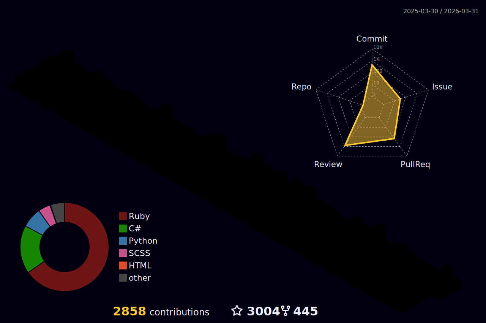

 

# Current

I am the founder of [Apnotic](https://apnotic.com) - a bootstrapped, privately held company focused on secure information distribution. We build [Password Pusher](https://pwpush.com), a platform used by thousands of organizations to securely share passwords, files and sensitive data.

I also build [HiveMQtt](https://hivemq.github.io/hivemq-mqtt-client-dotnet/) and run [Awesome MQTT](https://awesome-mqtt.com) - a curated collection of MQTT brokers, tools, libraries and resources.

# Open Source

## Password Pusher

Since 2011, I've built and maintained Password Pusher - a secure platform for sharing sensitive information with self-destructing links and full audit trails. Trusted by thousands of companies worldwide.

**By the numbers:**
- **100M+** secrets securely shared
- **345k** monthly active users at [pwpush.com](https://pwpush.com)
- **14+** years in production
- **31+** language translations
- **99.99%** historical uptime

The platform features AES-256 encryption, automatic expiration, passphrase protection, team collaboration and a powerful API. Available as a hosted SaaS (US & EU regions) or fully self-hosted via Docker/Kubernetes. White-label ready with 26 bundled themes.

## MQTT

I also build and maintain [HiveMQtt](https://hivemq.github.io/hivemq-mqtt-client-dotnet/) - the official C# MQTT client for .NET by [HiveMQ](https://www.hivemq.com/). It's fully MQTT 5.0 compliant and designed for enterprise-grade IoT deployments.

Features include async/await patterns, TLS/SSL security, WebSocket support and compatibility with .NET 6, 7, 8 and 9.

I also curate [Awesome MQTT](https://awesome-mqtt.com) - a collection of MQTT resources, brokers, tools and libraries.

# Past Open Source Work

**Instana** - APM instrumentation packages providing automatic distributed tracing, metrics and profiling for production applications.

**TraceView / Oboe** - Application performance monitoring for Tracelytics (now AppOptics). Low-level tracing instrumentation for Ruby applications.

# Other Past

More than 8 years building performance instrumentation for Instana & Tracelytics (now bought and renamed to IBM Instana & SolarWind AppOptics).

In other projects I've built embedded systems, distributed file systems, implemented protocols and architected SaaS products.

# Recent Posts

* [A Brief History of Instana](https://the0x00.dev/instana/History-of-Instana/)
* [How to Securely Send Passwords or Other Confidential Information](https://the0x00.dev/passwordpusher/How-and-Why-Send-Password-Securely/)
* [How to wrap (monkey patch) methods or functions in Python](https://the0x00.dev/python/How-to-monkey-patch-a-method-or-function-in-python/)
* [Using StarCraft II for AI Research](https://the0x00.dev/deep%20learning/python/ai/Using-StarCraft-2-for-AI-development/)
* [See More..](https://the0x00.dev)

# Statistics & Data

# Contact

* Email me at my github username at apnotic.com
* File a Github issue in this repo
* DM me on [X](https://x.com/pglombardo)
* Follow [Password Pusher on X](https://x.com/pwpush)
